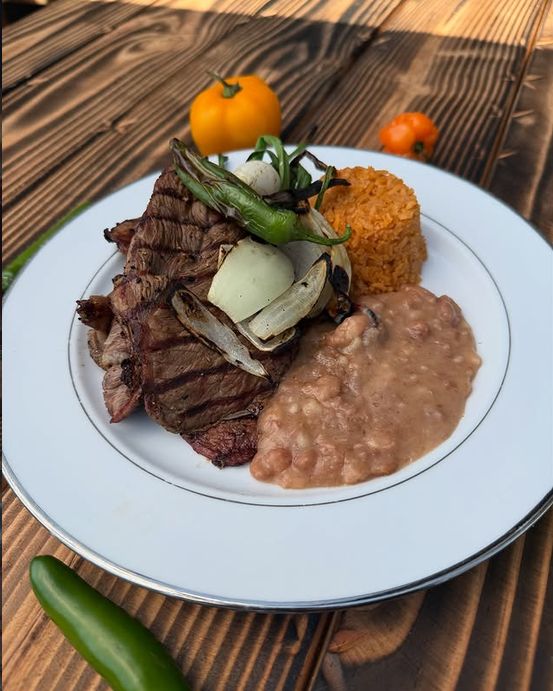

# Chef Gabe Catering

Website for Chef Gabe Inc. — traditional Mexican catering in Stockton, CA
(chefgabecatering.com).

Plain HTML, CSS and JavaScript. **No build step and no dependencies** — open
`index.html` in a browser, or deploy the folder as-is to any static host.

## Structure

```
chef-gabe-site/
├── index.html          Homepage
├── menus.html          Full menu, seven collapsible categories
├── contact.html        Quote calculator + enquiry form + contact details
├── css/styles.css      All styles for every page
├── js/
│   ├── translations.js Spanish/English dictionary (single source of copy)
│   ├── i18n.js         Applies the dictionary, handles the ES/EN toggle
│   ├── calculator.js   Event estimate calculator (contact page)
│   └── script.js       Mobile nav, footer year, menu accordion
├── images/             Photos, logos, and design mockups
└── README.md
```

## Pages

| Page | Status |
|---|---|
| `index.html` | Built. Real photos except the four dish cards. |
| `menus.html` | Built. Real menu content and pricing. Category photos are placeholders. |
| `contact.html` | Built. Working calculator and Netlify-ready form. |
| Our Food | Not built — `our-food.html` is linked from the nav |
| Events | Not built — `events.html` is linked from the nav |
| About | Not built — `about.html` is linked from the nav |

Design mockups for the pages still to build live in `images/`
(`events mockup.png`, `reviews mockup.png`).

## Language

**Spanish is the default.** English is available through the ES / EN toggle in
the utility bar, and the choice is saved to `localStorage` so it persists
between pages and visits.

There are no duplicate pages. All copy lives in `js/translations.js` as
parallel `es` and `en` objects, and elements pull from it by key:

```html
<h2 data-i18n="foodTitle">El Sabor de<br>Nuestras Raíces.</h2>
```

Spanish is also hardcoded inline in the HTML, matching the `es` value exactly,
so a first-time visitor never sees a flash of English before the script runs.

### Adding copy to a new page

1. Give each translatable element a `data-i18n="keyName"`.
2. Add that key to **both** `es` and `en` in `js/translations.js`.
3. Write the Spanish text inline in the HTML so it matches the `es` value.

Supported attributes:

| Attribute | Sets |
|---|---|
| `data-i18n` | element text |
| `data-i18n-alt` | `alt` |
| `data-i18n-aria-label` | `aria-label` |
| `data-i18n-content` | `content` (meta description) |
| `data-i18n-placeholder` | input/textarea `placeholder` |

Inside a string, `\n` becomes a `<br>` and `**bold**` becomes `<strong>`. Both
are built as DOM nodes rather than `innerHTML`, so dictionary text can never
inject markup.

Keys are shared across all pages, so prefix page-specific ones (`mn…` for
menus, `ct…`/`calc…`/`form…` for contact) to avoid collisions.

## The quote calculator (`contact.html`)

Prices live in the markup as `data-price` attributes, **not** in
`translations.js` — numbers are language-independent. Labels come from the
dictionary, so the itemised breakdown re-renders when the language changes.

- Each of the seven menu categories keeps its **own** guest count, so 30
  premium dinners and 80 desserts on one estimate works.
- Two add-ons (`fresh waters`, `fruit tray`) are flat fees with a quantity.
- The **$150 delivery, setup and equipment fee is mandatory** and added to any
  estimate with at least one line. It is omitted when nothing is selected,
  since an empty selection is not an estimate.
- A hidden `estimate-summary` textarea is filled with a plain-text breakdown
  so it is submitted along with the form.

To change a price, edit the `data-price` attribute on the relevant
`.calc-card` and the matching `catNPrice` display string in the dictionary.

## The contact form

Uses **Netlify Forms**, so no backend is required:

- `name="quote-request"`, `data-netlify="true"`, `method="POST"`
- a matching `<input type="hidden" name="form-name" value="quote-request">`
- a `bot-field` honeypot declared via `data-netlify-honeypot`

Netlify detects the form by parsing the deployed HTML, so **the form only
starts working once the site is deployed from this repo.** Where submissions
are emailed is set in Netlify (Site configuration → Forms → notifications),
not anywhere in this markup.

## Menu accordion (`menus.html`)

Panels carry the `hidden` attribute in the markup, so categories are closed
even if JavaScript never runs, and the content stays in the DOM for search
engines and Ctrl+F. Categories open independently. Deep links work:
`menus.html#panel-cat4` opens Soups & Broths.

## Placeholder images

Any photo still to be supplied is a striped block with a text label:

```html
<div class="placeholder-img dish-img" data-label="Carne Asada photo"></div>
```

To swap one in, drop the file into `images/` and replace the div with an
`` carrying the same classes so the sizing and cropping still apply:

```html

```

Still needed: the four homepage dish photos (carne asada, enchiladas,
carnitas, birria) and the seven menu category photos.

## Fonts

- **Cormorant Garamond** — headlines
- **Jost** — nav, body copy, buttons
- **Pinyon Script** — loaded but currently unused

## Colors (CSS variables in `css/styles.css`)

| Variable | Hex | Use |
|---|---|---|
| `--color-espresso` | #0A0A08 | utility bar, dark overlays |
| `--color-rust` | #94411B | primary buttons, accents, prices |
| `--color-olive` | #313220 | dark green bands, page headers |
| `--color-cream` | #EBE2D4 | main background |
| `--color-tan` | #DED1BE | footer background |
| `--color-offwhite` | #F4F4EF | light text, alternate sections |

Uppercase tracking and section spacing are also tokenised
(`--track-eyebrow`, `--track-nav`, `--track-label`, `--section-pad`) — use
those rather than hardcoding values.

## Contact details used on the site

- Phone / WhatsApp — (209) 747-6746
- Email — orderchefgabe@gmail.com
- Address — 1149 E Market St., Stockton, CA 95205
- Instagram — @agave_banquetes
- Facebook — profile id 100064198117109

## Known gaps

- Not deployed from this repo yet; the live domain still serves an older
  manual upload, and HTTPS on it fails with a certificate mismatch
- Business hours on `contact.html` came from the design mockup and need
  confirming
- `our-food.html`, `events.html` and `about.html` are linked but not built
